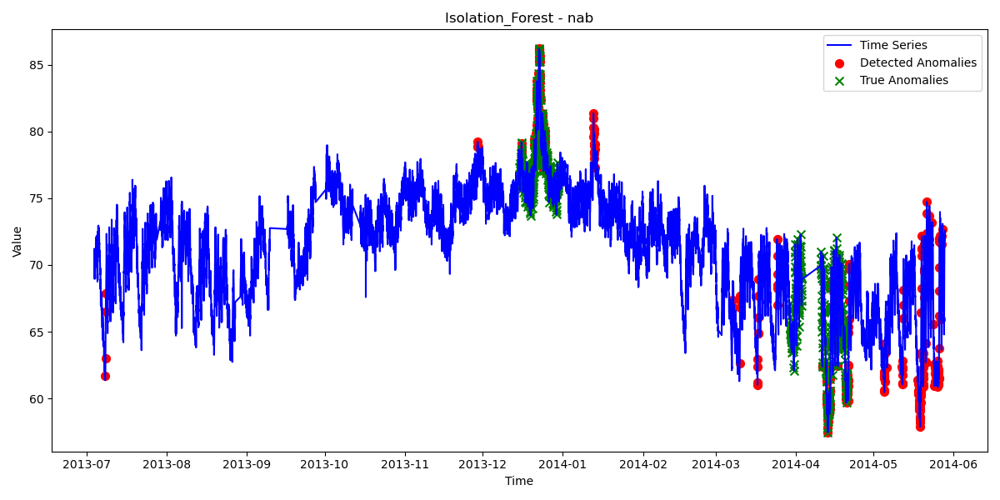
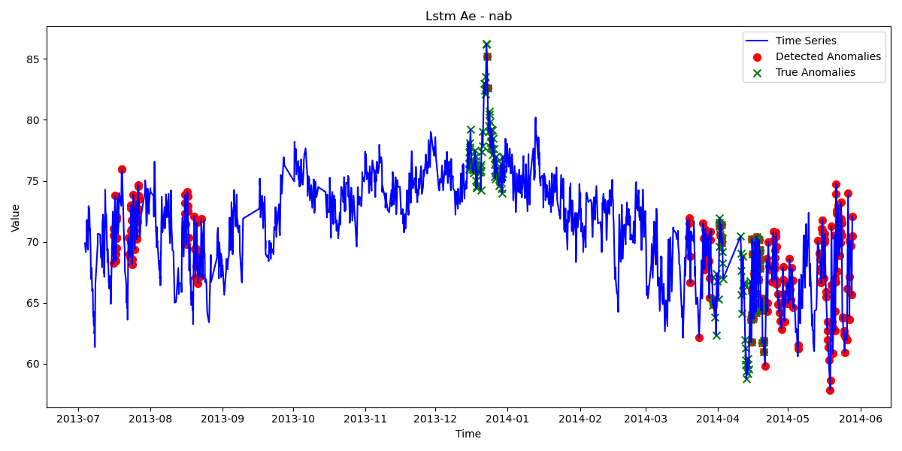

# Comparative Analysis of Statistical and Deep Learning Methods for Anomaly Detection in Time Series Data

This repository contains a robust anomaly detection framework for time series data, with implementations of both classical statistical methods and deep learning approaches. The system is designed to handle irregular and noisy sensor data, with built-in functionality for preprocessing, model training, cross-validation, and performance evaluation.



## Key Results

We evaluated various anomaly detection methods on the Numenta Anomaly Benchmark (NAB) dataset using 5-fold cross-validation to ensure reliable performance metrics. Our findings demonstrate the comparative strengths of different approaches:

| Model | F1 Score | Precision | Recall | False Positive Rate |
|-------|----------|-----------|--------|---------------------|
| Isolation Forest | 0.3203 | 0.3600 | 0.2885 | 0.0616 |
| ARIMA | 0.2309 | 0.1340 | 0.8333 | 0.6471 |
| LSTM Autoencoder | 0.2184 | 0.1781 | 0.2821 | 0.1564 |
| Seasonal Decomposition | 0.1390 | 0.1748 | 0.1154 | 0.0655 |

### Key Insights:

- **Isolation Forest** provides the best overall performance with a balance of precision and recall
- **ARIMA** detects the most anomalies (highest recall) but generates many false alarms
- **LSTM Autoencoder** offers moderate performance but requires more data and computational resources
- **Seasonal Decomposition** struggles with complex patterns but has a low false positive rate

## System Features

- **Data Preparation**:
  - Support for NAB and custom IoT datasets
  - Automatic handling of irregular sampling and missing data
  - Time series preprocessing and resampling

- **Model Implementations**:
  - Classical Models: ARIMA and Seasonal Decomposition
  - Machine Learning: Isolation Forest with temporal feature engineering
  - Deep Learning: LSTM Autoencoder

- **Robust Evaluation**:
  - Train/test splitting with time-based validation
  - K-fold cross-validation for time series
  - Comprehensive metrics including precision, recall, F1-score

- **Visualization**:
  - Interactive visualization with Plotly
  - Time series plots with highlighted anomalies
  - Performance comparison charts

## Sample Visualizations

### LSTM Autoencoder Performance

*LSTM Autoencoder performance on ambient temperature data. Note how the model detects anomalies primarily in the middle section of the data.*

### Isolation Forest Detection

*Isolation Forest effectively identifies anomalies throughout the time series with fewer false positives than other methods.*

## Installation

```bash
# Clone this repository
git clone https://github.com/yourusername/anomaly-detection-time-series.git
cd anomaly-detection-time-series

# Create and activate conda environment
conda create -n anomaly_detection_env python=3.8
conda activate anomaly_detection_env

# Install dependencies
pip install -r requirements.txt
```

## Usage

### Basic Usage

```bash
python main.py --dataset nab --data_path data/nab/data/realKnownCause/ambient_temperature_system_failure.csv --models isolation_forest --save_plots
```

### Train/Test Split Evaluation

```bash
python main.py --dataset nab --data_path data/nab/data/realKnownCause/ambient_temperature_system_failure.csv --labels_path data/nab/labels/combined_windows.json --models arima isolation_forest lstm_ae --time_split --test_split 0.3 --output_dir results/ambient_temp_split --save_plots
```

### Cross-Validation

```bash
python main.py --dataset nab --data_path data/nab/data/realKnownCause/ambient_temperature_system_failure.csv --labels_path data/nab/labels/combined_windows.json --models arima isolation_forest lstm_ae --cv_folds 5 --output_dir results/ambient_temp_cv --save_plots
```

### Command Line Arguments

- **Data Options**:
  - `--dataset`: Dataset type (nab, iot, or custom)
  - `--data_path`: Path to dataset file
  - `--labels_path`: Path to anomaly labels file

- **Model Options**:
  - `--models`: Models to use (arima, seasonal_decomp, isolation_forest, lstm_ae)
  - `--seq_length`: Sequence length for deep learning models (default: 60)
  - `--epochs`: Number of epochs for deep learning models (default: 50)

- **Evaluation Options**:
  - `--test_split`: Fraction of data to use for testing (default: 0.2)
  - `--cv_folds`: Number of cross-validation folds (default: 0)
  - `--time_split`: Use time-based train/test split (recommended for time series)
  - `--split_date`: Specific date to split train/test data

- **Output Options**:
  - `--output_dir`: Directory for saving results
  - `--save_plots`: Save plots to output directory
  - `--interactive`: Use interactive Plotly visualizations

## Project Structure

```
anomaly_detection/
├── main.py                # Main script to run the pipeline
├── requirements.txt       # Package requirements
├── src/
│   ├── data_preparation.py         # Data loading and preprocessing
│   ├── models/
│   │   ├── classical_models.py     # ARIMA, Seasonal Decomposition, Isolation Forest
│   │   └── deep_learning_models.py # LSTM Autoencoder
│   └── evaluation.py               # Metrics and visualization
├── results/               # Output directory for results
└── data/                  # Directory for datasets
```

## Author

- Ahmed Mir (am2552@rit.edu)
- Rochester Institute of Technology
- Course: Time Series Analysis, Spring 2024

## License

This project is licensed under the MIT License - see the LICENSE file for details.

## Acknowledgments

- [Numenta Anomaly Benchmark (NAB)](https://github.com/numenta/NAB) for providing the dataset and evaluation methodology
- PyTorch team for their deep learning framework

## Cross-Validation Methodology

Our implementation uses a time-based cross-validation approach specifically designed for time series data:

- **Dataset**: 7,267 data points with 726 labeled anomalies (10.0%)
- **Splitting Method**: Sequential time-based splitting (preserves temporal ordering)
- **Fold Size**: Each fold contains approximately 1,453 time points
- **Process**: For each fold iteration, one fold serves as test data while the remaining four folds are used for training

This approach ensures:
1. Models are evaluated on their ability to predict future anomalies based on past data
2. Temporal dependencies and patterns are preserved during evaluation
3. Performance metrics accurately reflect real-world deployment scenarios

The uneven distribution of anomalies across time periods creates a challenging but realistic evaluation environment. Cross-validation helps ensure our models can generalize to different segments of the time series rather than overfitting to specific patterns. 
